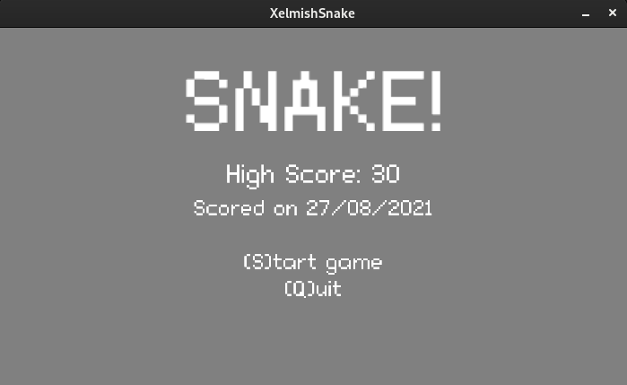
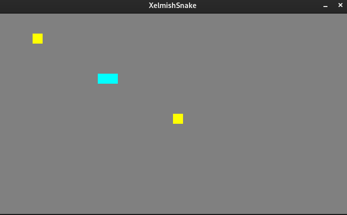
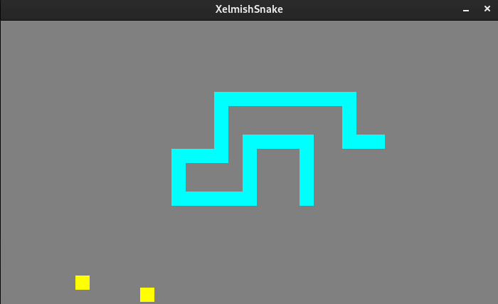

# Xelmish Snake

Xelmish Snake is a simple version of the classic snake game, built using Elm architecture
 via Chris Pritchard's [Xelmish](https://github.com/ChrisPritchard/Xelmish) package.

## Gameplay

### Starting the game

### Beginning Gameplay

### Mid Gameplay

## Requirements

- Dotnet 5.0
- Xelmish (it should install with `dotnet build` / `dotnet run`)
- MonoGame (installation instructions [here](https://docs.monogame.net/articles/getting_started/0_getting_started.html))

## License

MIT. The font used is under the SIL Open Font License (copy included in this repo).

## Credits

PlayScreen.fs is my own work (modeled roughly off of Chris Pritchard's [Tetris](https://github.com/ChrisPritchard/Xelmish/tree/master/samples/tetris-clone) example).
Other files (the start screen, game over screen, and screen manager) are mostly unchanged from [Tetris](https://github.com/ChrisPritchard/Xelmish/tree/master/samples/tetris-clone).